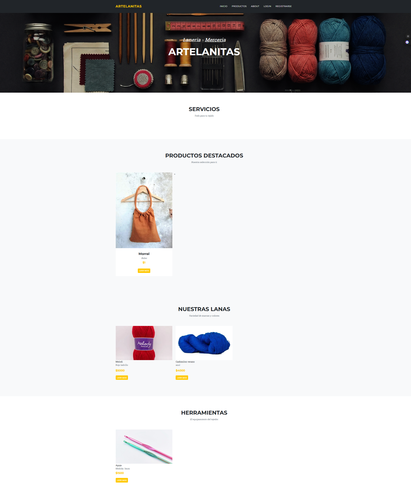
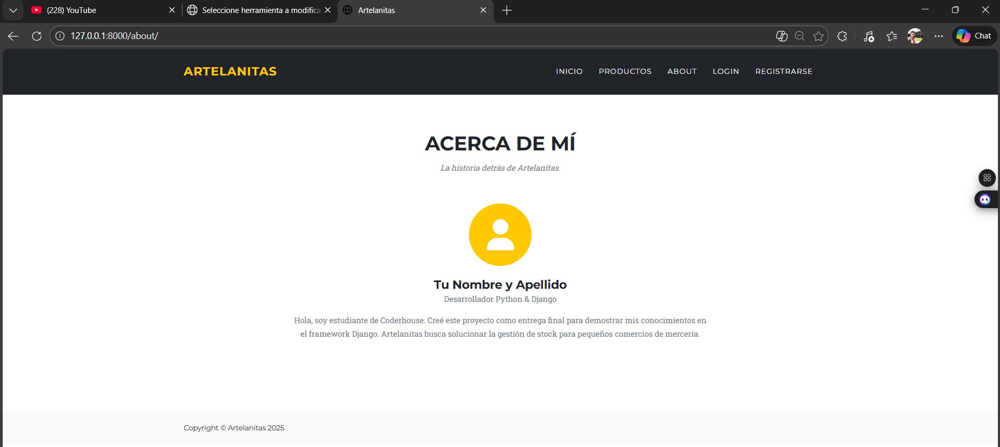
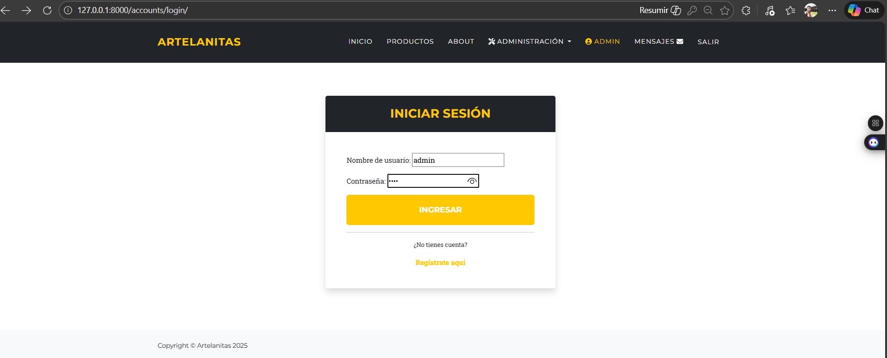
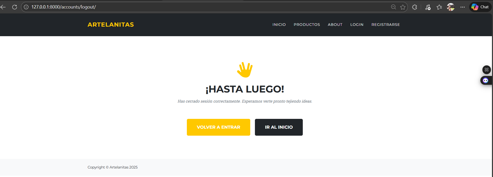
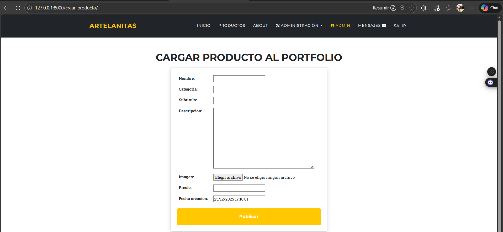
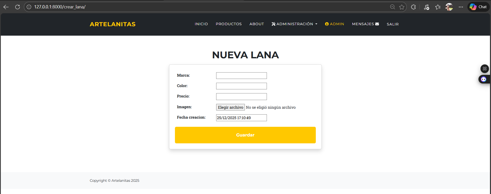
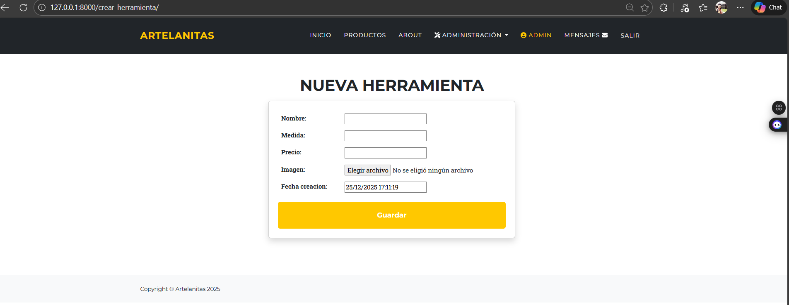
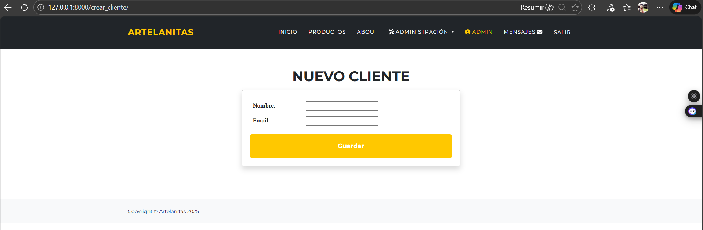
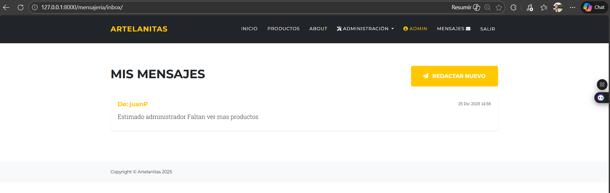

# 🧶 Artelanitas - Gestión de Stock para Lanería

Proyecto final para el curso de **Python & Django** en Coderhouse.

**Artelanitas** es una aplicación web completa diseñada para administrar el inventario y los productos de una mercería/lanería. Permite la gestión de usuarios, carga de productos con imágenes, y cuenta con un sistema de mensajería interna.

## 🚀 Funcionalidades Principales

### 1. Gestión de Usuarios (Accounts)
* **Registro e Inicio de Sesión:** Sistema completo de autenticación.
* **Perfil de Usuario:** Posibilidad de editar datos personales (nombre, email).
* **Avatar:** Carga y visualización de imagen de perfil (Avatar) personalizada.
* **Logout:** Cierre de sesión seguro.
* **Superuser:** usuario: admin / password: 1234

### 2. Gestión de Contenido (CRUD Completo)
El sistema permite Crear, Leer, Actualizar y Borrar (CRUD) tres tipos de ítems diferentes, todos con soporte para **subida de imágenes**:
* **Productos:** Productos terminados (ej: Bolsos, Gorros).
* **Lanas:** Materia prima (Marca, Color, Precio).
* **Herramientas:** Insumos de trabajo (Nombre, Medida).

*Nota: Las acciones de crear, editar y borrar están protegidas y requieren que el usuario esté logueado.*

### 3. Funcionalidades Extra
* **Mensajería Interna:** Sistema tipo "Inbox" para enviar y recibir mensajes privados entre usuarios registrados.
* **Vistas Basadas en Clases (CBV):** Uso de `DetailView`, `UpdateView`, `DeleteView`.
* **Mixins:** Implementación de `LoginRequiredMixin` para seguridad de rutas.
* **About & Pages:** Secciones informativas requeridas por la entrega.
* **Diseño Responsive:** Estilizado con Bootstrap 5 para adaptarse a móviles y escritorio.

## 🛠️ Tecnologías Utilizadas

* **Lenguaje:** Python 3.10+
* **Framework:** Django 5.x
* **Base de Datos:** SQLite3
* **Estilos:** HTML5, CSS3, Bootstrap 5
* **Editor de Texto:** CKEditor (para descripciones enriquecidas)

## 📸 Capturas de Pantalla

### Vista General

### Gestión de Usuarios

### Panel de Administración

**Formularios de Carga:**
| Productos | Lanas |
|:---:|:---:|
|  |  |

| Herramientas | Clientes |
|:---:|:---:|
|  |  |

### Extras
